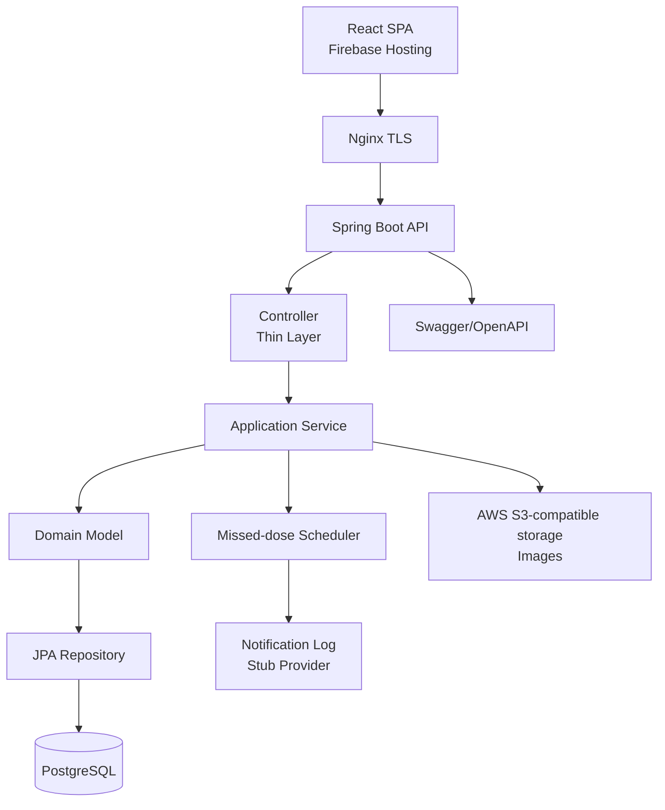
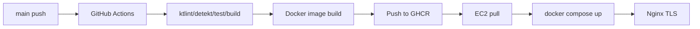
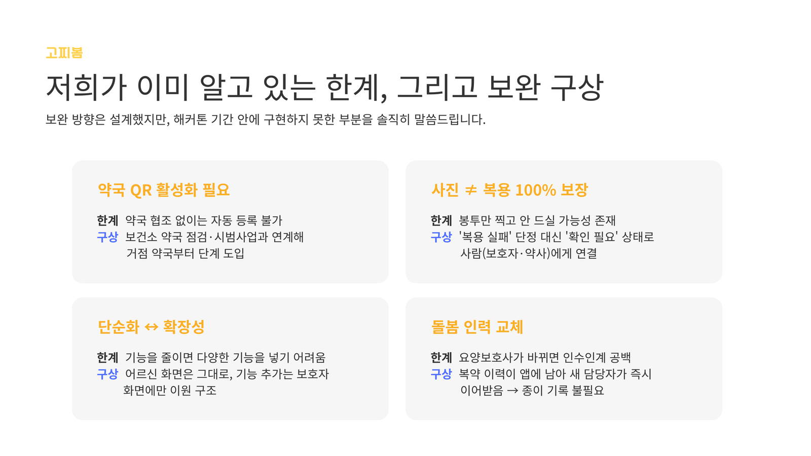

<div align="center">

# 고찌봄 Backend

### 약 먹는 순간이, 곧 안부가 되는 복약 안부 API

고찌봄 BE는 약국이 등록한 복약 정보를 바탕으로, 어르신의 복약 확인을 가족·복지사에게 연결하기 위한 백엔드 서버입니다.
Kotlin + Spring Boot 기반으로 API, PostgreSQL, 배포 파이프라인, TLS, 도메인 모델을 구성합니다.

<br />


<br />
<br />

[](https://kotlinlang.org/)
[](https://spring.io/projects/spring-boot)
[](https://www.postgresql.org/)
[](https://www.docker.com/)

</div>

---

## 🔗 Links

| 구분 | 링크 |
| --- | --- |
| Frontend Repository | https://github.com/TIKI-TAKA-hackathon/Tiki-Taka-FE |
| Live Demo | https://gojjibom.web.app/ |
| Swagger UI | `/swagger-ui/index.html` |
| Health Check | `GET /api/health` |

---

## 🧡 Project Overview

고찌봄은 **제주 지역 독거 어르신을 우선 대상으로 하는 복약 안부 서비스**입니다. 이름은
고찌(제주어 `같이`)와 봄(`바라봄 · 살펴봄 · 챙겨봄`)을 합친 말입니다. 혼자 약을 먹는 순간을
가족, 복지사, 약국이 같이 바라보고 챙긴다는 의미를 담았습니다.

약국이 QR로 복약 정보를 등록하면 어르신은 알림을 보고 큰 버튼 한 번과 사진 한 장으로 복약을
확인합니다. 백엔드는 이 과정에서 QR 기반 처방 조회, 복약 시간 관리, 복약 인증 기록 저장,
보호자 보드 조회, 사진 업로드 URL 발급을 담당합니다. 고찌봄은 사람의 돌봄을 대체하지 않고,
사람이 확인해야 할 순간을 더 빨리 발견하도록 돕는 것을 목표로 합니다.

---

## 🧡 Service Boundary

고찌봄은 의료 판단을 수행하지 않습니다.

- 약을 추천하지 않습니다.
- 처방을 변경하지 않습니다.
- 사진을 의료적 증거로 단정하지 않습니다.
- 미확인 상황은 ‘복용 실패’가 아니라 **확인 필요** 상태로 보호자·약사·돌봄 인력에게 연결합니다.

---

## 🏗️ Backend Role

<p align="center">
  
</p>

BE는 다음 흐름을 안정적으로 처리하는 것을 목표로 합니다. 현재 구현된 API와 후속 로드맵은 아래
API 표에서 구분합니다.

| 단계 | Backend 책임 |
| --- | --- |
| 케어그룹 | 어르신, 보호자, 가족, 사회복지사를 하나의 그룹으로 연결합니다. |
| 처방 등록 | 약국이 등록한 처방·약·복약 스케줄을 저장합니다. |
| 복약 이벤트 | 매일 복약 일정을 dose event로 생성하고 상태를 관리합니다. |
| 복용 확인 | 버튼·음성·사진 기반 확인 결과를 기록합니다. |
| 보호자 확인 | 보호자 보드에서 복약 상태와 확인 이력을 조회합니다. |
| 보호자 알림 | 미확인·지연·확인 필요 상황을 알림함에 기록하고 stub provider로 발송 흐름을 검증합니다. |

---

## 🛠️ Tech Stack

| 영역 | 기술 |
| --- | --- |
| Language | Kotlin 2.3.20, Java 21 |
| Framework | Spring Boot 4.1.0 |
| Build | Gradle 9 Wrapper |
| Database | PostgreSQL 16 |
| Migration | Flyway |
| API Docs | springdoc-openapi / Swagger UI |
| Infra | Docker Compose, Nginx, Certbot, Let's Encrypt |
| CI/CD | GitHub Actions → GHCR Image → EC2 Docker Compose |
| Quality | ktlint, detekt, test, build |
| Media | AWS S3-compatible object storage, Presigned URL |

---

## 🧩 Architecture



---

## 📁 Project Structure

```text
.
├── src/main/kotlin/xyz/stdiodh/gojjibom/
│   └── ...                       # Spring Boot application code
├── src/main/resources/
│   ├── application.yml            # datasource, cors, swagger config
│   └── db/migration/              # Flyway migration
├── docs/
│   ├── assets/                    # README images
│   ├── ERD.md                     # 복약 안부 도메인 ERD
│   └── PLAN.md                    # 백엔드 구현 계획서
├── nginx/conf.d/                  # TLS reverse proxy config
├── Dockerfile                     # multi-stage build
├── docker-compose.yml             # local/base compose
├── docker-compose.prod.yml        # production compose override
├── init-letsencrypt.sh            # cert bootstrap
├── .github/workflows/deploy.yml   # CI/CD
├── build.gradle.kts
└── settings.gradle.kts
```

---

## 🗄️ Domain Model

현재 마이그레이션과 코드에 존재하는 대표 모델은 다음과 같습니다.

| Domain | 설명 |
| --- | --- |
| `USERS` | 어르신, 보호자, 약사 공통 사용자 |
| `CARE_GROUPS` | 한 어르신을 함께 보는 복약 안부 그룹 |
| `CARE_GROUP_MEMBERS` | 대표 보호자, 가족, 사회복지사 등 참여자와 역할 |
| `INVITE_LINKS` | 보호자·복지사 초대 링크 및 사용 횟수 관리 |
| `PHARMACIES` | 처방 등록 주체인 약국 정보 |
| `PRESCRIPTIONS` | 약국이 등록한 처방 정보 |
| `MEDICATIONS` | 개별 약 정보와 사진 메타데이터 |
| `DOSE_SCHEDULES` | 아침·점심·저녁·취침 전 등 복약 스케줄 |
| `DOSE_SCHEDULE_ITEMS` | 복약 스케줄에 포함된 약 구성 |
| `DOSE_EVENTS` | 일자별 실제 복약 이벤트와 확인 상태 |
| `MEAL_TIMES` | 어르신별 식사 시간 기준 |
| `CHANGE_LOG` | 케어그룹 설정 변경 이력 |
| `NOTIFICATION_SETTINGS` | 어르신별 보호자 알림 설정 |
| `NOTIFICATIONS` | 보호자·복지사 알림함과 발송 상태 |
| `IMAGES` | 약 포지 사진 등 미디어 메타데이터 |
| `TTS_CLIPS` | 복약 안내 음성 캐시용 스키마 |

---

## 🔌 API Contract

도메인 API(`/api/v1/**`) 응답은 공통 envelope 형식을 따릅니다. Health check(`/api/health`)는
배포 검증용 단순 상태 응답입니다.

```json
{
  "data": {},
  "error": null
}
```

```json
{
  "data": null,
  "error": {
    "code": "ERROR_CODE",
    "message": "developer readable message"
  }
}
```

### 대표 API

| 흐름 | Method | Endpoint | 현재 상태 |
| --- | --- | --- | --- |
| Health Check | GET | `/api/health` | 구현됨 |
| OTP 인증 | POST | `/api/v1/auth/otp:request` | 구현됨 |
| OTP 인증 | POST | `/api/v1/auth/otp:verify` | 구현됨 |
| 사용자/보호자/어르신 연결 | POST | `/api/v1/care-groups` | 구현됨 |
| 사용자/보호자/어르신 연결 | GET | `/api/v1/care-groups:lookup?seniorPhone=` | 구현됨 |
| 사용자/보호자/어르신 연결 | GET | `/api/v1/care-groups/{id}` | 구현됨 |
| 사용자/보호자/어르신 연결 | POST | `/api/v1/care-groups/{id}/invite-links` | 구현됨 |
| 사용자/보호자/어르신 연결 | POST | `/api/v1/invites/{token}:accept` | 구현됨 |
| 케어그룹 멤버 관리 | PATCH/DELETE | `/api/v1/care-groups/{id}/members/{memberId}` | 구현됨 |
| 대표 보호자 이전 | PATCH | `/api/v1/care-groups/{id}/primary` | 구현됨 |
| 변경 이력 조회 | GET | `/api/v1/care-groups/{id}/change-log` | 구현됨 |
| 복약 알림 기준 관리 | GET/PUT | `/api/v1/seniors/{seniorId}/meal-times` | 구현됨 |
| 복약 알림 정보 관리 | GET/PUT | `/api/v1/seniors/{seniorId}/notification-settings` | 구현됨 |
| QR 기반 약 등록 | GET | `/api/v1/prescriptions:lookup?code=` | 구현됨 |
| QR 기반 약 등록 | POST | `/api/v1/seniors/{seniorId}/prescriptions` | 구현됨 |
| 처방 이력 조회 | GET | `/api/v1/seniors/{seniorId}/prescriptions` | 구현됨 |
| 복약 스케줄 조회 | GET | `/api/v1/seniors/{seniorId}/dose-schedules` | 구현됨 |
| 복약 이벤트 조회 | GET | `/api/v1/seniors/{seniorId}/doses?date=YYYY-MM-DD` | 구현됨 |
| 복약 이벤트 조회 | GET | `/api/v1/dose-events/{id}` | 구현됨 |
| 복약 인증 기록 저장 | POST | `/api/v1/dose-events/{id}:confirm` | 구현됨 |
| 복약 사진 검토 | PATCH | `/api/v1/dose-events/{id}/photo:review` | 구현됨 |
| 어르신 홈 BFF | GET | `/api/v1/senior/today?seniorId=` | 구현됨 |
| 보호자 상태 확인 | GET | `/api/v1/care-groups/{id}/board` | 구현됨 |
| 사진 갤러리 | GET | `/api/v1/care-groups/{id}/photos` | 구현됨 |
| 사진 기반 인증 보조 | POST | `/api/v1/media/images/upload-url` | 구현됨 |
| 사진 기반 인증 보조 | POST | `/api/v1/media/images` | 구현됨 |
| 사진 기반 인증 보조 | GET | `/api/v1/media/images/{id}/view-url` | 구현됨 |
| 보호자 알림 | GET | `/api/v1/seniors/{seniorId}/notifications` | 구현됨 |
| 보호자 알림 | GET | `/api/v1/care-groups/{id}/notifications` | 구현됨 |
| 보호자 알림 | PATCH | `/api/v1/notifications/{id}:read` | 구현됨 |

카카오 알림톡과 SMS 외부 발송은 후속 provider 확장 대상입니다. 현재 기본 provider는 외부 I/O 없이
로그로 발송 흐름을 검증하는 `stub`입니다.

---

## ⚙️ Environment

```bash
cp .env.example .env
```

대표 환경 변수는 다음과 같습니다.

| 변수 | 설명 |
| --- | --- |
| `POSTGRES_DB` | Docker Compose PostgreSQL DB 이름 |
| `POSTGRES_USER` | Docker Compose PostgreSQL 사용자명 |
| `POSTGRES_PASSWORD` | Docker Compose PostgreSQL 비밀번호 |
| `SPRING_DATASOURCE_URL` | PostgreSQL JDBC URL |
| `SPRING_DATASOURCE_USERNAME` | DB 사용자명 |
| `SPRING_DATASOURCE_PASSWORD` | DB 비밀번호 |
| `APP_CORS_ALLOWED_ORIGINS` | 허용할 FE origin |
| `APP_NOTIFICATIONS_MISSED_GRACE_MIN` | 미복용 판단 유예 시간 |
| `APP_NOTIFICATIONS_PROVIDER` | 보호자 알림 provider, 기본값 `stub` |
| `APP_NOTIFICATIONS_SCHEDULER_ENABLED` | 미복용 감지 스케줄러 활성화 여부 |
| `APP_NOTIFICATIONS_SCHEDULER_FIXED_RATE_MS` | 미복용 감지 스케줄러 실행 주기 |
| `AWS_REGION` | S3 region |
| `AWS_S3_BUCKET` | 이미지 저장용 비공개 S3 bucket |
| `AWS_S3_ENDPOINT` | S3-compatible endpoint, 선택값 |
| `AWS_S3_PATH_STYLE_ACCESS` | S3-compatible storage의 path-style 접근 여부 |
| `AWS_ACCESS_KEY_ID`, `AWS_SECRET_ACCESS_KEY` | 정적 AWS credential, EC2 IAM role을 쓰지 않을 때만 사용 |
| `APP_MEDIA_MAX_IMAGE_BYTES` | 업로드 가능한 이미지 최대 크기 |
| `APP_MEDIA_UPLOAD_URL_TTL_SECONDS` | 업로드 presigned URL 만료 시간 |
| `APP_MEDIA_VIEW_URL_TTL_SECONDS` | 조회 presigned URL 만료 시간 |

---

## 🚀 Local Development

PostgreSQL을 Docker로 실행한 뒤 Spring Boot를 실행합니다. 아래 값은 `application.yml`의 로컬 기본 DB
접속값과 맞춘 예시입니다.

```bash
POSTGRES_DB=gojjibom POSTGRES_USER=gojjibom POSTGRES_PASSWORD=gojjibom docker compose up -d postgres
./gradlew bootRun
```

`.env`를 사용하는 경우 `POSTGRES_PASSWORD`와 `SPRING_DATASOURCE_PASSWORD`가 서로 맞아야 합니다.

Health check:

```bash
curl http://localhost:8080/api/health
```

---

## ✅ Quality Gate

```bash
./gradlew ktlintCheck detekt test build
```

---

## 🚢 Deploy & Operate

운영 배포 흐름은 다음과 같습니다.



운영 서버에서는 Nginx가 TLS를 종료하고 Spring Boot API로 reverse proxy합니다.

---

## 🔐 Security & Privacy Principles

| 원칙 | 설명 |
| --- | --- |
| 개인정보 최소 수집 | 복약 안부에 필요한 정보만 저장합니다. |
| QR 토큰화 | QR에는 개인정보를 직접 담지 않고 서버에서 권한 확인 후 조회합니다. |
| 그룹 기반 인가 | 케어그룹 멤버만 어르신 데이터에 접근할 수 있도록 설계합니다. |
| 로그 마스킹 | 전화번호, 토큰, 인증 정보 등은 원문 로그에 남기지 않습니다. |
| 사진 비공개 저장 | 약 포지 사진은 비공개 버킷과 짧은 만료의 presigned URL로 제공하는 것을 목표로 합니다. |

---

## ⚠️ Known Limits & Response

<p align="center">
  
</p>

| 한계 | 대응 방향 |
| --- | --- |
| 약국 QR 활성화 필요 | 거점 약국·보건소 시범사업부터 단계 도입 |
| 사진이 복용을 100% 증명하지 못함 | ‘확인 필요’ 상태로 보호자·약사에게 연결 |
| 알림 벤더 장애 가능성 | 보호자 알림함과 외부 발송 provider를 별도 로드맵으로 설계 |
| 서버 장애 가능성 | 앱 로컬 알림과 서버 복구 후 동기화 구조로 보완 |
| 개인정보 위험 | QR 토큰화, 권한 분리, 접근 로그, 비공개 미디어 저장 |

---

## 🧭 Roadmap

| 단계 | 목표 |
| --- | --- |
| 현재 구현 | Health, CORS, CI/CD, TLS, DB/Flyway, 케어그룹, 초대 링크, 처방·스케줄, dose event, 식사 시간, 알림 설정, 미복용 감지, 보호자 알림함, 보호자 보드, 사진 갤러리, S3 이미지 presigned URL |
| 후속 확장 | 카카오 알림톡/SMS provider, 재알림·에스컬레이션 고도화, TTS 안내 음성, 권한 강화, 관측성, 성능 최적화 |

---

## 👥 Team

| 이름 | 역할 | 담당 |
| --- | --- | --- |
| 김주영 | 팀장 | 서비스 방향성 검토, 리스크 피드백 |
| 허동현 | PM & Development Lead | 백엔드 아키텍처, DB/API 설계, 배포 인프라 총괄 |
| 박윤아 | Presentation & Research | 발표 준비, 자료조사, 대본 구성 |
| 강지연 | UX/UI Design | 브랜드·화면 디자인 |
| 이재영 | Research & Evidence | 통계 근거 정리, TTS 자료 준비 |

---

## 🏁 Goal

<p align="center">
  
</p>

고찌봄 백엔드는 복약 데이터를 단순히 저장하는 서버가 아니라,
**약국-가족-지역사회가 함께 어르신의 안부를 확인하는 연결망**을 만드는 것을 목표로 합니다.
