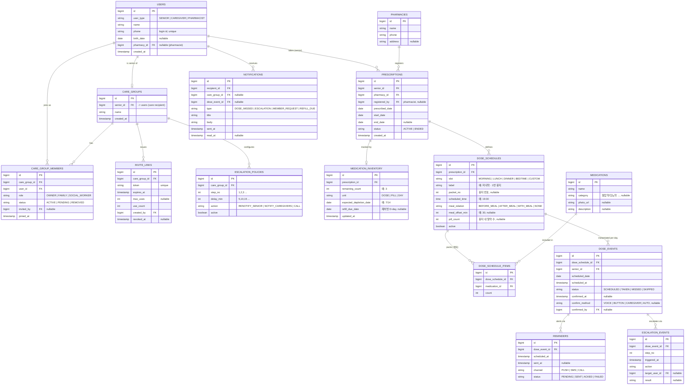

# 고찌봄 ERD (복약 안부 도메인)

와이어프레임(어르신 / 보호자·복지사 플로우)에서 도출한 데이터 모델입니다. 각 엔티티 옆에 근거가 된
화면을 적어 추적 가능하게 했습니다. `[MVP]`는 1차 구현 대상, `[LATER]`는 이후 단계입니다.

## 다이어그램

## 엔티티 설명 (근거 화면)

- **USERS** `[MVP]` — 어르신/보호자·가족/사회복지사/약사 공통 계정. `user_type`으로 구분. 어르신은 "어르신 기기로 시작하기"(기기 페어링), 보호자·복지사는 계정 로그인. 약사는 `pharmacy_id` 연결. (온보딩 화면)
- **CARE_GROUPS** `[MVP]` — 한 어르신을 함께 보는 단위("어머니 복약 상태"). 어르신 1명 = 그룹 1개(초기). (보호자 대시보드)
- **CARE_GROUP_MEMBERS** `[MVP]` — "함께 보는 사람" 참여자. `role`=방장/가족/사회복지사, `status`=참여중/승인대기/내보냄. 방장이 승인·거절·내보내기. (함께 보는 사람 화면)
- **INVITE_LINKS** `[MVP]` — 초대 링크(24시간 만료·사용 횟수·재발급). 새 요청 시 방장에게 알림. (함께 보는 사람 화면)
- **PHARMACIES / (약사=USERS)** `[MVP]` — "약국에서 등록한 복약 정보만 안내". 처방 등록 주체. (온보딩 하단 고지)
- **PRESCRIPTIONS** `[MVP]` — 약국이 어르신에게 등록한 처방(재처방 포함). 시작·종료일, 상태. (약 개수 추적/재처방 D-day)
- **MEDICATIONS** `[MVP]` — 봉지에 들어가는 개별 약 카탈로그(예: 혈압약). 사진(`photo_url`) → "약 사진 보기". (어르신 다음 약 카드)
- **DOSE_SCHEDULES** `[MVP]` — 시간대별 복약(봉지) 정의: 아침/점심/저녁, 예정시각, 식전·식후 N분, 봉지번호, 알약 수. (오늘 복약 리스트)
- **DOSE_SCHEDULE_ITEMS** `[MVP]` — 봉지 구성(어떤 약이 몇 개). "혈압약이 포함돼 있어요". (어르신 다음 약 카드)
- **DOSE_EVENTS** `[MVP]` — 일자별 복약 이벤트/복용 확인 로그. `status`=예정/완료/미복용, `confirm_method`=음성/버튼, 확인 시각·확인자. 어드히어런스의 핵심. (오늘의 복용 확인)
- **MEDICATION_INVENTORY** `[LATER]` — 약 개수 추적: 남은 개수, 예상 소진일, 재처방 D-day. (약 개수 추적 카드)
- **REMINDERS** `[MVP]` — dose_event별 예약 알림(예: 오후 7:30 알림). (다음 약 · 알림 배지)
- **ESCALATION_POLICIES** `[LATER]` — 재알림·에스컬레이션 정책(1차 +5분, 2차 10분, 3차 15분 → 에스컬레이션). 그룹 단위 설정. (확인 필요 카드)
- **ESCALATION_EVENTS** `[LATER]` — 실제 에스컬레이션/재알림 로그 = "타임라인 보기". 미확인 시 보호자 알림·전화 유도. (확인 필요 카드)
- **NOTIFICATIONS** `[LATER]` — 보호자/복지사 알림함(미복용·에스컬레이션·참여 요청·재처방 임박 등). (전반)

## 설계 노트

- **파생 지표는 저장하지 않음**: "최근 7일 요약", "가족 2명/사회복지사 1명" 카운트는 `dose_events` /
  `care_group_members` 집계로 계산(뷰/쿼리). 중복 저장 금지.
- **앱 확인은 보조 정보**: 화면 문구대로 `dose_events.status`는 의료 판단이 아닌 안부 신호. 응답/로그에
  진단성 표현을 넣지 않음.
- **개인정보 최소화**: 전화번호 등 민감정보는 응답/로그에 노출하지 않음(마스킹). PII는 필요한 화면에만.
- **시간대**: 복약 시각은 Asia/Seoul 기준. `scheduled_at`은 timestamptz로 저장.
- **Flyway**: 위 스키마는 `src/main/resources/db/migration`의 `V2__*.sql`부터 단계적으로 추가.
